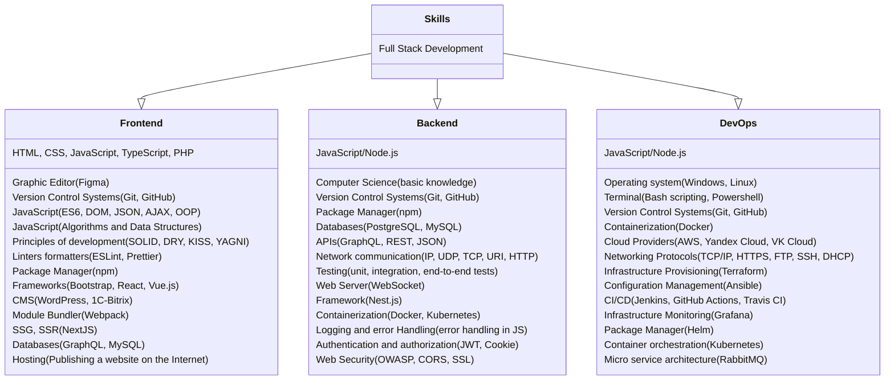

## Work Experience
At the moment, my professional activity is related to retail and warehouse logistics.  I have been interested in programming since 2022 and study it in my free time on Coursera, Codewars, Stepik and other platforms.  I have practical experience in developing educational projects. In the future, I will work in the field of digital technology.

## Education
#### Minsk State Regional College  
**Marketing Economist** `(01.09.2010 - 12.07.2012)`

Strategies for promoting products and services to increase sales and total revenue of the company have been studied. Consumer market research, brand control, participation in the creation of advertising campaigns and much more.

### Languages

English: `Intermediate`

Russian: `Native`

### Contacts

